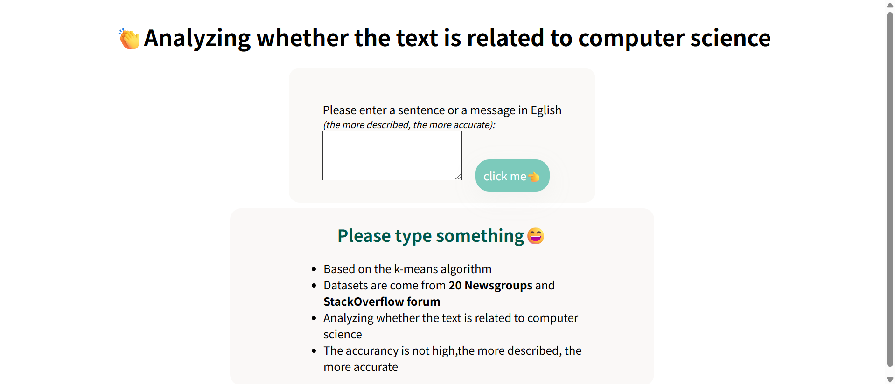
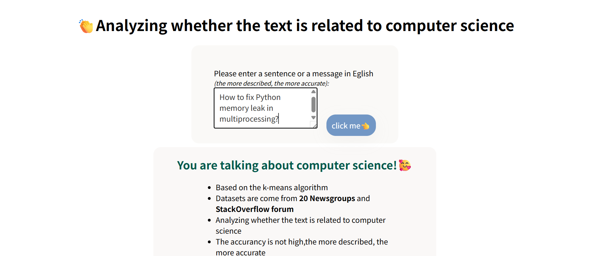

<a id="readme-top"></a>
<br />
<div align="center">
  <a href="https://github.com/huahuaguang">
    
  </a>

<h3 align="center">Simple text anlysis</h3>

  <p align="center">
    Based on the <strong>k-means algorithm</strong>.<br>
    Datasets are come from 20 Newsgroups and StackOverflow forum.<br>
    Analyzing whether the text is related to computer science.<br>
    The accurancy is not high,the more described, the more accurate
    <br>
   <p><em>Since the datasets are fetched on the web, the author's code is licensed under all licenses consistent with them.</em></p>
    <a href="#demo">View Demo</a>
  </p>
</div>


<!-- TABLE OF CONTENTS -->
<details>
  <summary>Table of Contents</summary>
  <ol>
    <li>
      <a href="#about-the-project">About The Project</a>
    </li>
    <li>
      <a href="#getting-started">Getting Started</a>
    </li>
    <li><a href="#usage">Usage</a></li>
    <li><a href="#contact">Contact</a></li>
    <li><a href="#acknowledgments">Acknowledgments</a></li>
  </ol>
</details>


<!-- ABOUT THE PROJECT -->
## About The Project
<h3 id="demo">Demo</h3>
<p>Initial page</p>
<br>
<p>Type somthing and after you click the button</p>
<br>

<h3 id="intro">Introduction</h3>

1. **The "datasets" folder contains two subfolders that are the original datasets**:
   - **20news-bydate**: This is a newsgroup dataset that contains information related to the field of computer science.
   - **stackoverflow**: This is a high-quality technology forum dataset downloaded from GitHub, and it has already been processed.

2. **ajorclassification.py file**: This file is used to clean and organize the original datasets to generate a dataset that meets the target requirements. Running this file will generate the target dataset file, which is the "computer_related_text_dataset.csv" located in the "datasets" folder.

3. **train_model.py file**: This is the file used for model training. Running it will generate two .pkl files in the "models" folder.

4. **test_array.py file**: This is the file used for testing the model. It uses an array as input for simulation and then outputs whether the statement is related to computers.

5. **Suggestion**:Delete the two .pkl files under the models folder, delete the computer_related_text_dataset.csv files under the datasets folder, run the MajorClassification.py first, and then run the train_mode.py. The files deleted above are generated. Finally, enter the <strong>python app.py</strong> on the command line, and then open the localhost:8083 web page in your browser.

<!-- GETTING STARTED -->
## Getting Started

To get up and running locally, follow these simple example steps.
### Dependencies
1. Open termial for this project folder, and type.
```sh
   pip install flask,pandas,numpy,joblib,scikit-learn,matplotlib,pandas
```
### Installation

1. Change git remote url to avoid accidental pushes to base project
   ```sh
   git remote set-url origin huahuaguang/MajorAnalysis
   git remote -v # confirm the changes
   ```

<!-- USAGE EXAMPLES -->
## Usage

Download the whole file and open "index.html" in Chrome or Edge.

<!-- CONTACT -->
## Contact

Estera - esterawang@163.com

<p align="right">(<a href="#readme-top">back to top</a>)</p>

<br><br><br>
<h2>中文简介</h2>

1. **datasets 文件夹中的两个子文件夹是原始数据集：**
   - **20news-bydate**：这是新闻组数据集，其中包含计算机领域的信息。
   - **stackoverflow**：这是从 GitHub 下载的高质量科技论坛数据集，它已经被处理过。

2. **majorclassification.py 文件**：该文件用于清理和整理原始数据集，以生成符合目标需求的数据集。运行该文件生成目标数据集文件，即datasets文件夹下面的computer_related_text_dataset.csv。
3. **train_mode.py 文件**：这是用于模型训练的文件。运行生成models文件夹下的两个pkl文件。
4. **test_array.py 文件**： 这是用于测试模型的文件，使用数组进行输入模拟，然后输出语句是否和计算机有关。
5. **运行建议**：删除models文件夹下面的两个.pkl文件，和datasets文件夹下面的computer_related_text_dataset.csv。先运行MajorClassification.py，然后运行train_mode.py，会生成上面删除的文件。最后在命令行输入python app.py，然后在浏览器打开localhost:8083网页。
